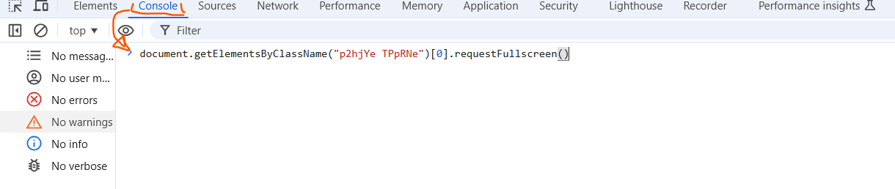

# Some Codes For a Better Experience of Using Google Meet:

> The First Code Is Short And Esay but hasn't any Features:
```javascript

document.getElementsByClassName("p2hjYe TPpRNe")[0].requestFullscreen()

```

 # --------------------------------------------------------------------------

> The Second Code:
```javascript

javascript:!function(){const e=`button-${window.__meetsRandomNumber=window.__meetsRandomNumber||Math.floor(1e6*Math.random())}`;[...document.getElementsByClassName(e)].forEach((e=>e.remove())),[...document.getElementsByTagName("video")].forEach((function(n){const t=document.createElement("button");t.setAttribute("tabindex",1),t.setAttribute("class",e),t.setAttribute("style","\n      z-index: 999999999;\n      background: white;\n      width: 28px;\n      height: 28px;\n      position: absolute;\n      right: 50px;\n      display: block;\n      border-radius: 14px;\n      margin: 8px;\n      background-image: url('data:image/svg+xml;base64,PD94bWwgdmVyc2lvbj0iMS4wIiBlbmNvZGluZz0iVVRGLTgiPz4NCjxzdmcgeG1sbnM9Imh0dHA6Ly93d3cudzMub3JnLzIwMDAvc3ZnIiB3aWR0aD0iMjAiIGhlaWdodD0iMjAiIHZpZXdCb3g9IjAgMCAyMCAyMCI+DQogIDx0aXRsZT4NCiAgICBmdWxsc2NyZWVuDQogIDwvdGl0bGU+DQogIDxwYXRoIGZpbGwtcnVsZT0iZXZlbm9kZCIgZD0iTTEgMXY2aDJWM2g0VjFIMXptMiAxMkgxdjZoNnYtMkgzdi00em0xNCA0aC00djJoNnYtNmgtMnY0em0wLTE2aC00djJoNHY0aDJWMWgtMnoiLz4NCjwvc3ZnPg0K');\n      background-repeat: no-repeat;\n      background-position: center;\n      filter: invert(1);\n    "),t.addEventListener("focus",(()=>{t.style.outline="5px solid #c00"})),t.addEventListener("blur",(()=>{t.style.outline=""})),"none"!==n.style.display&&(n.parentElement.parentElement.appendChild(t),t.addEventListener("click",(e=>{n.requestFullscreen(),n.addEventListener("fullscreenchange",(function e(){document.fullscreenElement||(n.removeEventListener("fullscreenchange",e),t.focus())}))})))}))}();

```

 # --------------------------------------------------------------------------

>## How To Use:
1. Open the "Inspect" Feature Panel of Your Browser.
   * Press "F12" or Make a right click on the meet area and then Click on "inspect"
2. Paset One of the above code in the "console" section.
3. Hit the Enter to execute the code.


   
